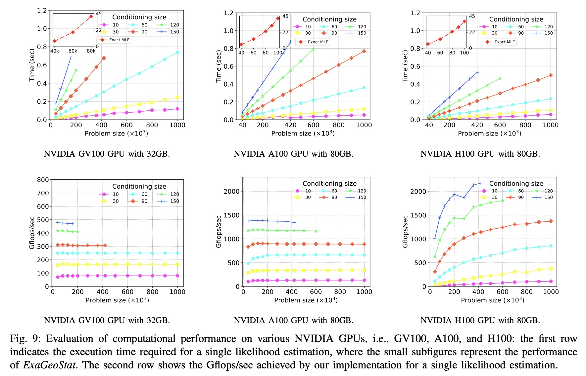

## ParallelVecchiaGP
The ParallelVecchiaGP initiative involves concurrently adapting the Vecchia approximation for Gaussian Processes (GP), using batched linear algebra solvers on GPUs for computation, i.e., KBLAS-GPU. This code is designed exclusively for GPU execution. It demonstrates impressive precision compared to the exact maximum likelihood estimates. In terms of KL divergence, the accuracy of ParallelVecchiaGP is notable, achieving levels between ***$`\boldsymbol{10^{-1}} `$ to $` \boldsymbol{10^{-3}}`$ with only 60 neighbors***. Furthermore, the program can efficiently handle up to 1 million locations on a single 32GB GPU.

#### 1. Installation Guidence

Installation of MAGMA 2.6.0 and NLopt v2.7.1, please refer to:

  - MAGMA 2.6.0 and KBLAS-GPU
  - 1. Download https://icl.utk.edu/magma/downloads/ (Guidance) 
  - 2. Install guide. Please use intel MKL https://icl.utk.edu/projectsfiles/magma/doxygen/installing.html
  - 3. For example, `bash installExample.sh`
  - Nlopt v2.7.1 (easy guidance) https://nlopt.readthedocs.io/en/latest/NLopt_Installation/

#### 2. Usage 

Below are two examples demonstrating the use of block Vecchia. Following these steps, your results will be saved in the ./log file.

0. Helper 
`./bin/test_dvecchia_batch --help (-h)`

1. Performance tests, such as monitoring the time or calculating the intermediate results in KL divergence,
`./bin/test_dvecchia_batch --ikernel 1.5:0.1:0.5 --kernel univariate_matern_stationary_no_nugget --num_loc 20000 --perf --vecchia_cs 300 --knn --seed 0`

2. Real dataset.
`./bin/test_dvecchia_batch --ikernel ?:?:? --kernel univariate_matern_stationary_no_nugget --num_loc 250000   --vecchia_cs 90 --knn --xy_path replace_your_location_path --obs_path replace your_observation_path`
(optional)
`--kernel_init 0.1:0.1:0.1  --tol 9 --omp_threads 40`

#### References
Pan, Q., Abdulah, G., Marc, Ltaief, H., Keyes, D., & Sun, Y. (2024). GPU-Accelerated Vecchia Approximations  of Gaussian Processes for Geospatial Data using Batched Matrix Computations. In High-Performance Computing: 39th International Conference, ISC High Performance 2024, Frankfurt/Main, Germany, May 12–16, 2024, Proceedings 39. Springer International Publishing.

